# Documentación Funcional - DeMuFe

## 1. Objetivos de la Web

**DeMuFe** es una tienda en línea especializada en la venta de vehículos tuning y modificados. El objetivo principal es ofrecer una plataforma intuitiva donde los usuarios puedan:

- Navegar por un catálogo de vehículos modificados
- Ver información detallada de cada vehículo
- Valorar y opinar sobre los productos
- Realizar compras de forma segura
- Gestionar su perfil e historial de pedidos

## 2. Perfiles de Usuario

### 2.1 Cliente (Comprador)
- **Navegación**: Puede ver el catálogo, filtrar por categoría/marca, ver detalles del producto
- **Carrito de compra**: Puede añadir productos sin estar logueado. Los datos se guardan en localStorage
- **Registro**: Formulario con validaciones completas (nombre, fecha DD/MM/YYYY, teléfono internacional, dirección con patrón, fortaleza de contraseña)
- **Perfil**: Puede ver y editar sus datos personales
- **Historial**: Puede ver sus pedidos anteriores y su estado
- **Opiniones**: Puede valorar productos con estrellas y texto después de comprar
- **Tickets**: Puede abrir tickets de soporte sobre productos

### 2.2 Administrador (Botiguer)
- **Dashboard**: Resumen de estadísticas (productos, pedidos, usuarios, stock bajo)
- **Productos**: CRUD completo, descuento masivo, ordenación por stock/precio/ventas
- **Pedidos**: Gestión de estados (pendiente, completado, enviado, cancelado)
- **Usuarios**: Ver, editar y eliminar usuarios
- **Tickets**: Gestionar tickets de soporte (abrir/cerrar)
- **Ventas**: Gráfico de barras con canvas mostrando ventas por producto
- **Marcas**: CRUD de marcas

## 3. Diseño de la Interfaz

### 3.1 Estilo General
- Tema oscuro: `bg-linear-to-tl from-black to-primary`
- Color primario: azul `#0061ad`
- Texto blanco con opacidades para jerarquía
- Iconos: PrimeIcons (`pi-*`)
- Componentes: Volt (PrimeVue unstyled) para inputs, selects, etc.

### 3.2 Estructura de la Navegación

**Cabecera (HeaderBase)**:
```
[Logo] | Catálogo | Contáctanos | Dónde encontrarnos | FAQs | [Si logueado: Mi Perfil | Mis Pedidos | Mis Tickets] | [Si admin: Panel Admin] | [Carrito] | Iniciar sesión / Hola, Nombre
```

**Menú móvil**: Menú desplegable con las mismas opciones en vertical.

### 3.3 Páginas Principales

| Ruta | Nombre | Descripción |
|------|--------|------------|
| `/` | HomePage | Landing con enlaces rápidos |
| `/catalog` | Catálogo | Cuadrícula de productos con filtros |
| `/cars/:slug` | CarView | Detalle del producto + valoraciones |
| `/cart` | Carrito | Lista de productos a comprar |
| `/checkout` | Checkout | Proceso de pago |
| `/contactUs` | ContactUs | Formulario de consulta |
| `/profile` | Perfil | Edición de datos personales |
| `/my-orders` | Historial | Pedidos del usuario |
| `/listTickets` | Tickets | Tickets del usuario |
| `/admin/*` | Admin | Panel de administración |

### 3.4 Panel de Administración

El panel admin tiene una navegación propia reutilizable (`AdminNav.vue`):

```
[Panel Admin]
[Dashboard] [Productos] [Pedidos] [Usuarios] [Tickets] [Ventas]
```

- El enlace activo se muestra con `bg-white/10 font-semibold`
- Cada vista tiene su propio contenido bajo esta navegación

## 4. Funcionalidades Detalladas

### 4.1 Autenticación
- **Login**: email + contraseña, genera token Sanctum
- **Registro**: Validaciones por campo:
  - Nombre: 1-2 nombres + 1-2 apellidos, sin números, auto-capitalización
  - Fecha: Formato DD/MM/YYYY, validación de edad 18-99 años
  - Teléfono: Código internacional (+XX...)
  - Dirección: Patrón "Calle + número, CP Ciudad"
  - Contraseña: Barra de fortaleza con `<meter>`, nivel medio o fuerte requerido
  - Indicadores visuales: Verde/rojo por campo al hacer blur
- **Logout**: Elimina el token actual

### 4.2 Carrito de Compra
- Almacenamiento en `localStorage` (persistente entre sesiones)
- Añadir/eliminar/modificar cantidades
- Precio total por producto y total del carrito
- Se mantiene si el usuario no está logueado

### 4.3 Proceso de Compra (Checkout)
- Selección de dirección de envío y facturación
- Checkbox "misma dirección" para reutilizar
- Procesamiento del pedido: descuento de stock, registro en BD
- Confirmación con toast de éxito

### 4.4 Sistema de Valoraciones
- API REST con 4 endpoints:
  - `GET /api/getOpinions/{id}` - Opiniones de un producto
  - `POST /api/sendOpinion` - Enviar opinión
  - `GET /api/getRating` - Top 10 productos valorados
  - `GET /api/getAllOpinions` - Todas las opiniones
- Recordatorio post-compra: flag `has_to_comment` en `order_items`
- Comprobación AJAX al login para mostrar recordatorio
- Modal "ReviewReminderModal" con opciones: Opinar / Ahora no / Recuérdamelo más tarde

### 4.5 Sistema de Tickets
- Creación de ticket (público, sin autenticación)
- Listado de tickets propios (autenticado)
- Administración: filtrar por estado, cerrar/reabrir

## 5. Capturas de Pantalla

- **Pantalla de inicio**: HomePage con logo y navegación

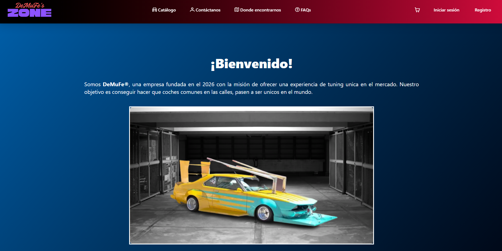
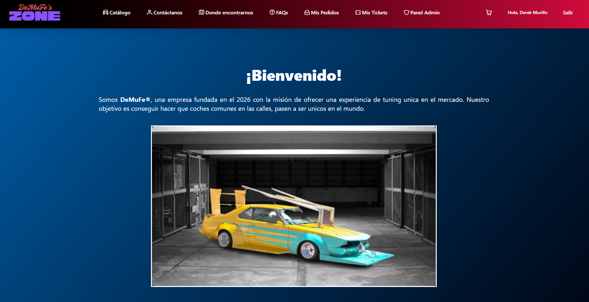

- **Catálogo**: Cuadrícula de productos con imágenes y precios

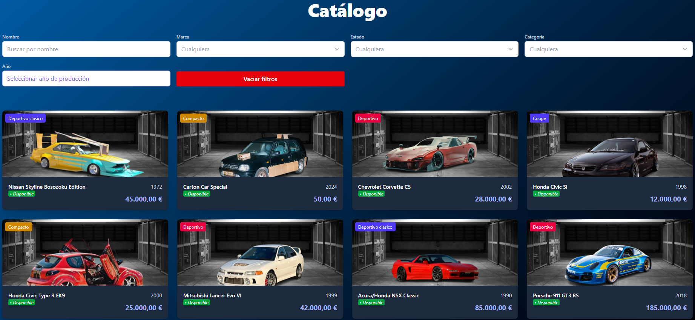

- **Detalle producto**: CarView con estrellas, opiniones, formulario de opinión

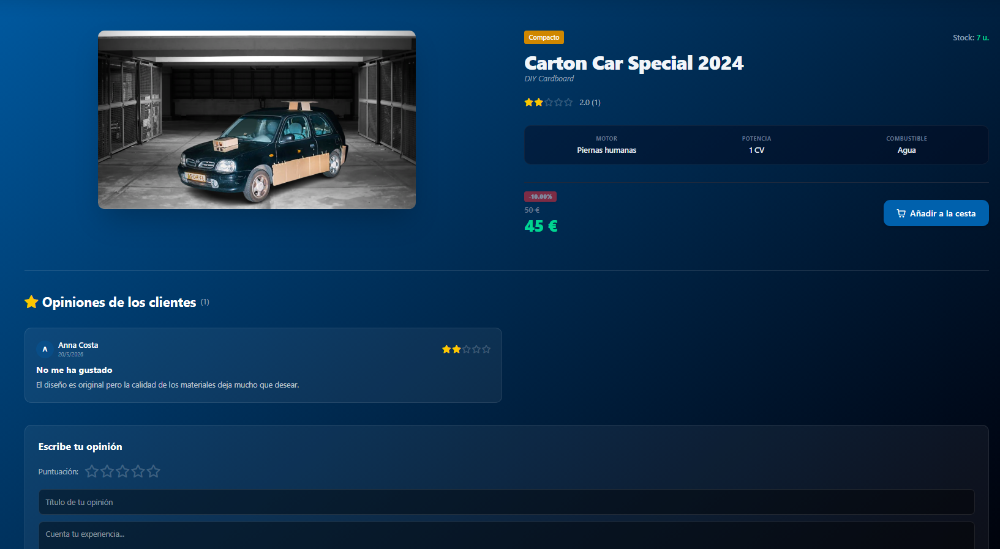

- **Carrito**: Lista de productos, cantidades, total

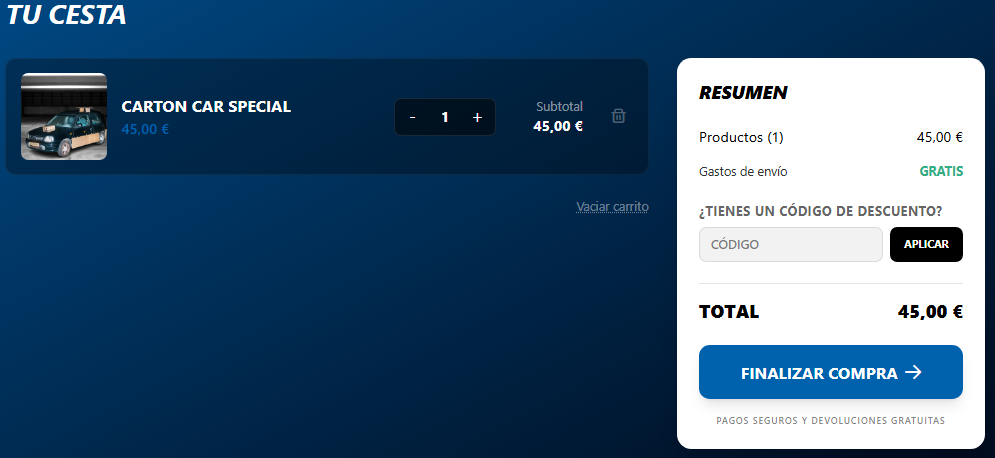

- **Checkout**: Formulario de pago

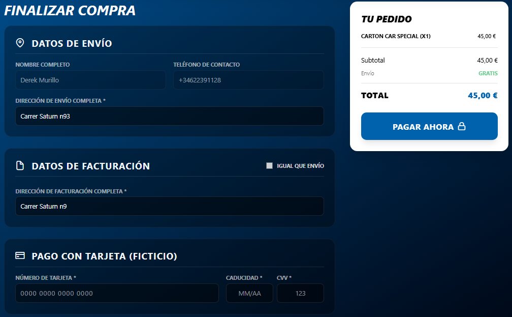

- **Perfil**: Formulario de edición de datos

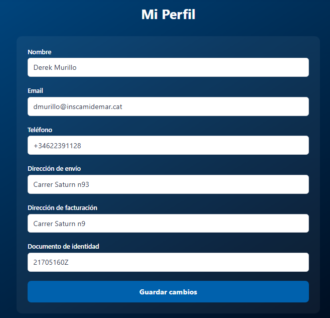

- **Historial**: Lista de pedidos con estados

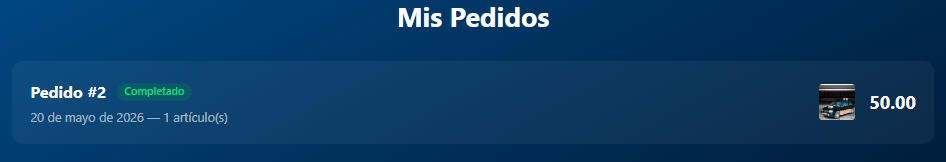

- **Panel Admin**: Dashboard, productos, pedidos, usuarios, tickets, ventas

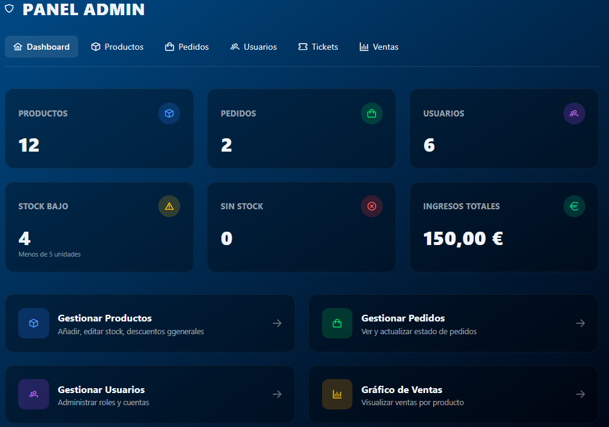

- **Formulario de registro**: Campos con validaciones e indicadores visuales

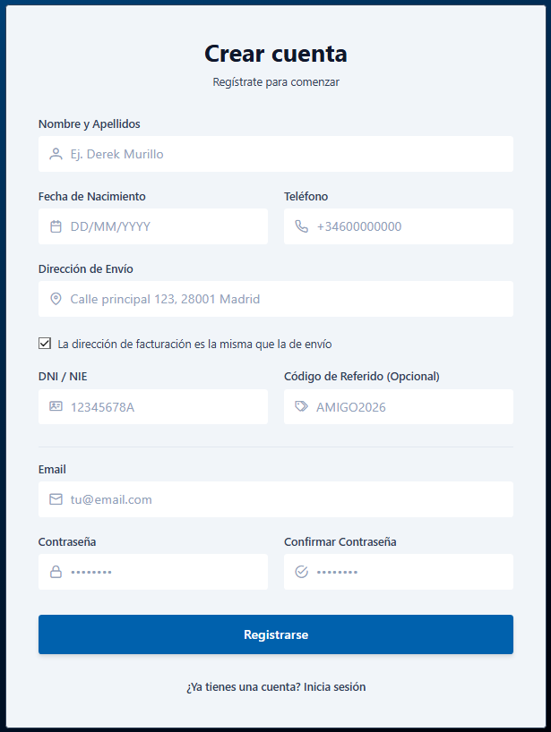

- **Modal recordatorio de opinión**: ReviewReminderModal

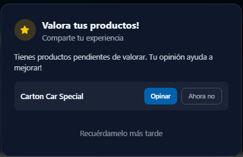
